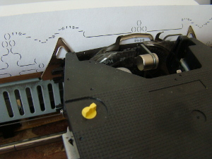

.. Generador de Valores documentation master file, created by
   sphinx-quickstart on Mon Apr 23 18:42:21 2012.
   You can adapt this file completely to your liking, but it should at least
   contain the root `toctree` directive.

Generador de valores es el proyecto de `martinez-zea
<http://martinez-zea.info>`_ realizado para la `Oncena Bienal de la Habana
<http://www.bienalhabana.cult.cu/>`_

Sobre el proyecto
=================

.. toctree::
    :maxdepth: 2

    Informacion general <proyecto>

Documentacion tecnica
=====================

.. toctree::
   :maxdepth: 2
   
   GeneradorDeValores
   WebApp
   Hardware

Agradecimientos y enlaces a software utilizado
==============================================

.. toctree::
    :maxdepth: 2
    
    Agradecimientos

Indices and tables
==================

* :ref:`genindex`
* :ref:`modindex`
* :ref:`search`

